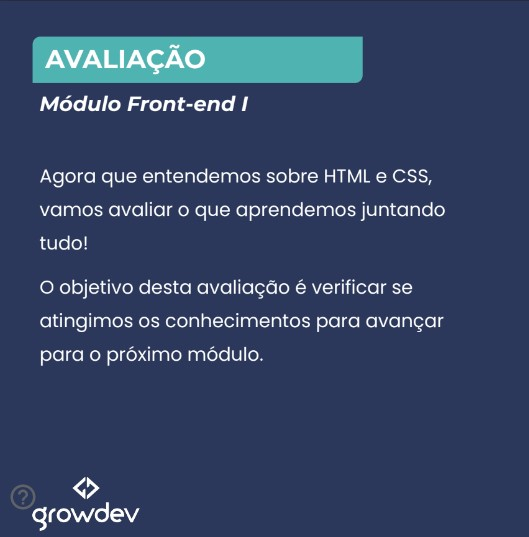
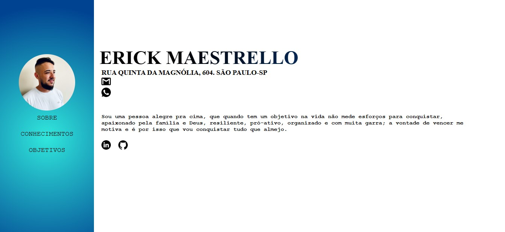
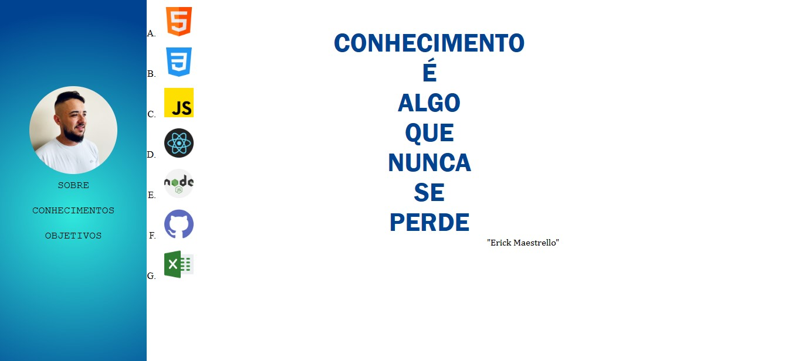
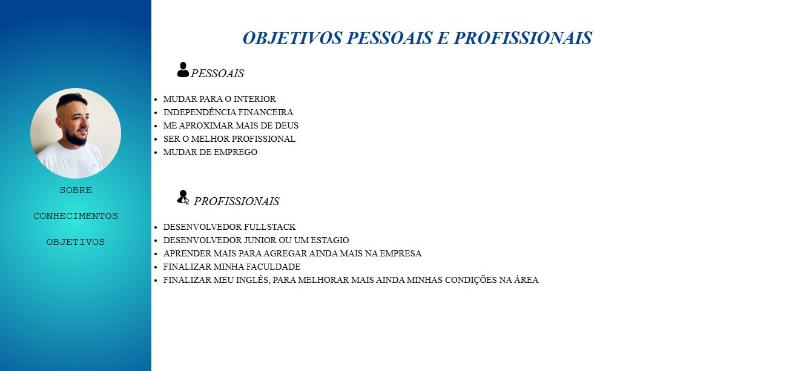

# Projeto Front-End 1 - Desenvolvido para GrowDev
 
 
 

# Currículo Digital

 
 
 

# SOBRE O PROJETO "Curriculo Digital"
## Esta aplicação permite que o recrutador interaja melhor com o candidato e deixa seu curriculo mais informativo e melhor visto.
 
 
 

# Acesse aqui o [Currículo Digital](https://erickcurriculodigital.netlify.app/)
 
 
 

# 3 PROTÓTIPOS

 
 
 

# Tecnologias

 
 
 

# Definição
## Pagina ira alterar até o final do curso Programa Starter FullStack Web, previsto para o final deste ano! conforme for aprendendo novas linguagens e Frames e adquirindo mais conhecimento, enquanto isso fique a vontade para ver meu currículo e entrar em contato.
 
 
 

# AUTOR

## ERICK MAESTRELLO
## [@Erick Linkedin](https://www.linkedin.com/in/erick-maestrello/)
